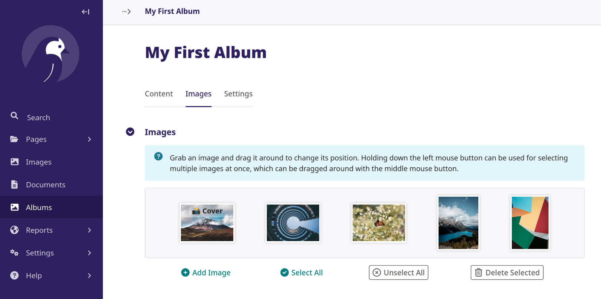

# Wagtail Photo Gallery

With this extention you are just a few steps away from a simple photo gallery for your wagtail page.



The gallery is configurable with the wagtail admin panel and is suited for large amounts of photos.

The key idea of this package is to store and manage photos independently of the usual wagtail images.
Instead, all photos are assigned to albums and can be managed by a drag-and-drop sorting widget (which also supports item selection for mass-dragging and deletion).

To organize your photos, a `Collection` is assigned to each album, by default the _Root_ `Collection` is used.
Embedding the photo gallery within a `StreamField` is now done by adding a `GalleryBlock` with reference to the desired `Collection`.

## Installation

```sh
pip install wagtail-photo-gallery[pillow]
# or
pip install wagtail-photo-gallery[pillow-simd]
```

If you need the fastest possible image uploading (Faster resizing) use `pillow-simd`.

## Settings

Add the following to your settings *(base.py)*:

```py
INSTALLED_APPS = [
    #...
    'wagtail_photo_gallery',
    'wagtail.contrib.routable_page',
    #...
]
```

Update your database structure using (remember to create a **backup first**):

```sh
./manage.py migrate
```

## Example

Once you've installed this addon and configured the settings as above,
all you need to do is to inherit from `ImageGalleryMixin` and to add `GalleryBlock` to your `StreamField`.

```py
# models.py

from wagtail.models import Page
from wagtail.fields import StreamField

from wagtail.admin.panels import FieldPanel

from wagtail_photo_gallery.blocks import GalleryBlock
from wagtail_photo_gallery.mixins import ImageGalleryMixin

class YourWagtailPage(ImageGalleryMixin, Page):
    
    content = StreamField([
        #...
        ("gallery", GalleryBlock()),
        #...
    ], blank=True)
    
    # content panel for the CMS (same as always)
    content_panels = Page.content_panels + [
        FieldPanel("content"),
    ]
```

If you want to use the pre-defined *CSS-flexbox* layout for the albums,
you need to include the following css code in your gallery page (`YourWagtailPage`)

```

```

### Minimal template example

```





template-homepage


    
        
    



    

```
